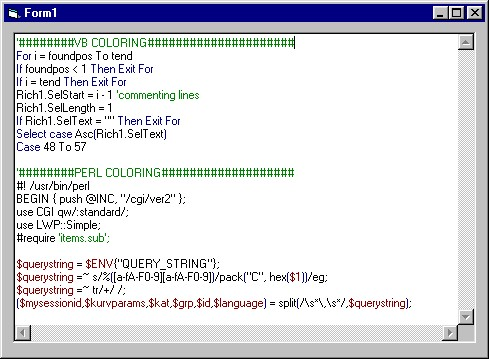



## \[ \[ A Color Code in Richtextbox

### Description

!! The easyest way to color your code in a

richtextbox. Easy to setup. Colorize your

code in 1 minute. For VB Code, Perl code etc. PLEACE VOTE!
 
### More Info
 

             |
---                |---
**Submitted On**   |2002-04-02 16:48:14
**By**             |[Pamela RAI](https://github.com/Planet-Source-Code/PSCIndex/blob/master/ByAuthor/pamela-rai.md)
**Level**          |Intermediate
**User Rating**    |4.3 (90 globes from 21 users)
**Compatibility**  |VB 4\.0 \(32\-bit\), VB 5\.0, VB 6\.0
**Category**       |[Complete Applications](https://github.com/Planet-Source-Code/PSCIndex/blob/master/ByCategory/complete-applications__1-27.md)
**World**          |[Visual Basic](https://github.com/Planet-Source-Code/PSCIndex/blob/master/ByWorld/visual-basic.md)
**Archive File**   |[a\_\_1\_Color67829422002\.zip](https://github.com/Planet-Source-Code/pamela-rai-a-color-code-in-richtextbox__1-33350/archive/master.zip)

### API Declarations

1 to reduce flicker, but can be removed

